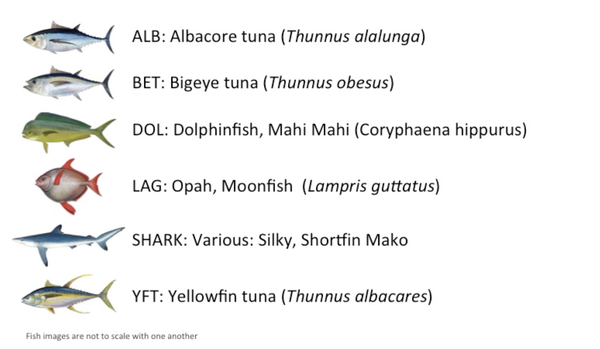
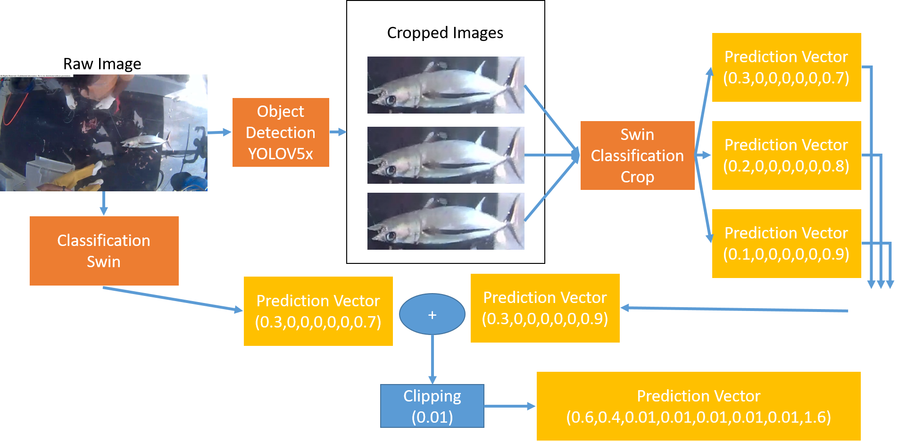

# The Nature Conservancy Fisheries Monitoring

This repository is the implementation of Kaggle competitions [Fisheries classification](https://www.kaggle.com/c/the-nature-conservancy-fisheries-monitoring/overview). 






## Requirements

To install requirements:

```setup
pip install -r requirements.txt
```


## Training

### YOLO

To train the model(s), run this command:

```train
python3 train_yolov5.py --data ./data/fish.yaml --batch 16 --epochs 50 --cfg models/yolov5x.yaml --name <model name> --weights yolov5x.pt --imgsz 640
```

* scheduler use `ReduceLROnPlateau`
* optimizer  use `SGD`, momentum = 0.937, weight_decay = 5e-4
* Data augmentation(HSV-Hue augmentation, HSV-Saturation augmentation, HSV-Value augmentation, image translation, image scale)

### Swin

To train the model(s), run this command:

```train
python train.py --data_path <train_data_path> --classes_path <classes.txt> --training_labels_path <training_labels.txt> --batch_size 8 --lr 2e-4 --pretrain_model_path <pretrain_model_path> --output_foloder <model output path> --epochs 100
```

* scheduler use `ReduceLROnPlateau`
* optimizer  use `SGD`, momentum = 0.9, weight_decay = 1e-4
* Data augmentation(RandomResizedCrop, RandomHorizontalFlip, ColorJitter, RandomRotation, GaussianBlur)

## Reproduceing Submission

[yolo model link](https://drive.google.com/file/d/16yIeHyiIisshYLJoeuw9Pn78PUgyg4-w/view?usp=sharing)

[swin model link](https://drive.google.com/file/d/1amUqIkADJpOfgdOWKvL-cyk5yiIjXURu/view?usp=sharing)

run [`./object_detection/inference_merge.ipynb`](https://github.com/a07458666/FisheriesMonitoring/blob/master/object_detection/inference_merge.ipynb)

>📋 Will output `answer.csv`
## Pre-trained Models

### Swin
You can download pretrained models here:

- [ImageNet-21K Pretraining for the Masses
](https://github.com/Alibaba-MIIL/ImageNet21K) trained on ImageNet.

- Or use timm to load the model

### YOLO
You can download pretrained models here:

[assets]: https://github.com/ultralytics/yolov5/releases

|Model |size<br><sup>(pixels) |mAP<sup>val<br>0.5:0.95 |mAP<sup>val<br>0.5 |Speed<br><sup>CPU b1<br>(ms) |Speed<br><sup>V100 b1<br>(ms) |Speed<br><sup>V100 b32<br>(ms) |params<br><sup>(M) |FLOPs<br><sup>@640 (B)
|---                    |---  |---    |---    |---    |---    |---    |---    |---
|[YOLOv5m][assets]      |640  |45.2   |63.9   |224    |8.2    |1.7    |21.2   |49.0
|[YOLOv5x][assets]      |640  |50.7   |68.9   |766    |12.1   |4.8    |86.7   |205.7

```
model = timm.create_model('vit_base_patch16_224_miil_in21k', pretrained=True)
```

## Results

Our model achieves the following performance on :

### Image Classification

| Model name         | Private Score  | Public Score |
| ------------------ |---------------- | -------------- |
| My best model      |     1.45189     |      1.05184       |
